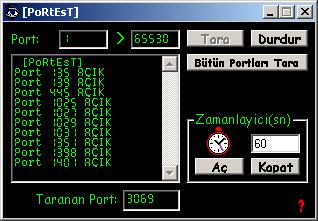

<div align="center">

## Port Tarayici


</div>

### Description

Quick Port Scanner. (For only Turkish WinSock Programmers. Because when I was coding I used a Turkish explains) ...
 
### More Info
 


<span>             |<span>
---                |---
**Submitted On**   |
**By**             |[Yigit Aktan](https://github.com/Planet-Source-Code/PSCIndex/blob/master/ByAuthor/yigit-aktan.md)
**Level**          |Intermediate
**User Rating**    |5.0 (25 globes from 5 users)
**Compatibility**  |VB 6\.0
**Category**       |[Coding Standards](https://github.com/Planet-Source-Code/PSCIndex/blob/master/ByCategory/coding-standards__1-43.md)
**World**          |[Visual Basic](https://github.com/Planet-Source-Code/PSCIndex/blob/master/ByWorld/visual-basic.md)
**Archive File**   |[](https://github.com/Planet-Source-Code/yigit-aktan-port-tarayici__1-27259/archive/master.zip)


### Source Code

```
' Ilk önce Form Penceresinde gerekli düzenlemeler yapilir.
' 5 Button, 5 tanede Text Box, 1 Timer ve 1 de Winsock yaratiliir.
' Buttonlar:
' 1 Button Bütün Portlari taramasi için.
' 2 Button Tara/Durdur olarak yaratilir.
' 2 Buttonda Zamanlayicinin Aç/Kapati olacak.
' Text Boxlar:
' 1 Text Box Zamanlayicinin Saniye göstergesi olacak.
' 2 Text Box Baslangic ve Bitis Portunu gösterecek.
' 1 Text Box Taranan Portlarin gösterilmesi için olacak.
' Ve Son olan Text Box da Tarama sirasindaki gerekli bilgilerin yazilacagi yer olacak.
' Bazi degisimler yapmaniz gerekiyor çünkü yazdigim kodda ben öyle yaptim.
' Formumuza koydugumuz Timer in ismini "saniye2" yapin
' Eger Visual Basic ToolBox inizda Winsock yoksa ToolBox a sag okla tiklayin,
' Components a girin ve ordan seçin.
' Formumuza koydugumuz Winsock in ismini "soketler" yapin
' Text1.Text -----> ilkPort.Text (Textine 1 yazin)
' Text2.Text -----> sonPort.Text (Textine 65530 yazin)
' Text3.Text -----> tanananPortlar.Text
' Text4.Text -----> liste.Text (MultiLinei "True" ve ScrolBarsi "Vertical" yapin)
' Text5.Text -----> saniye.Text (Textine 60 yazin böylelikle her 1 dakikada bir tarama yapar)
' Command1 -----> Tara (bu Commandlarda Name e yazilir Caption Farketmez)
' Command2 -----> Durdur
' Command3 -----> BütünPortlariTara
' Command4 -----> ZamanlayiciAç
' Command5 -----> ZamanlayiciKapat
' Form üzerindeki tamamlamalarimiz bittikten sonra Kodlarimiza basliyoruz...
' Eeee artik baslamanin zamani geldi. Ilk önce degiskenleri tanimliyoruz.
' ©opy®ight 2001 - Yigit Aktan
' I hate School, Hack The Planet
' yigitaktan@yahoo.com
Dim portnumarasi As Long
Dim Baslat As String
Dim Zamanlayici As String
Private Sub Tara_Click()
Durdur.Enabled = True
If ilkPort.Text = "" Then
' Scannerimizi bi salagin kullanacagini düsünerek, Port numaralarinin
' unutulmasi takdirde bize uyari mesaji vermesini sagliyoruz.
MsgBox "Tarama için bir Port numarasi girin"
Exit Sub
End If
If sonPort.Text = "" Then
MsgBox "Tarama için bir Port numarasi girin"
Exit Sub
End If
ilkPort.Locked = True
sonPort.Locked = True
Tara.Enabled = False
' soketler bizim bildigimiz WinSock :-)
soketler.Close
Baslat = True
liste.Text = " [Scannerin ismini falan yaz]"
Call portlartaraniyor
' Tarama bittiginde veya Durdur Buttonuna bastigimizda,
' bize hangi Portlar arasinda tarama yapildigini göstersin.
liste.Text = liste.Text & vbCrLf & "Tarama Sonucu: " & ilkPort.Text & "- " & tarananPortlar.Text & " arasindaki Portlar basariyla tarandi."
End Sub
Sub portlartaraniyor()
' Degiskeni tanimliyoruz.
Dim portnumarasi2 As Long
portnumarasi = ilkPort.Text
' sonPort.Text bizim duracagimiz Port numarasini belli ediyor..!!
portnumarasi2 = sonPort.Text
Durdur.Enabled = True
' Çikabilecek hatalardan dolayi tedbirimizi aliyoruz.
On Error GoTo hata
Do
' ilk Port tarandi simdi sira öteki Portlarda...
portnumarasi = portnumarasi + 1
DoEvents
If Baslat = True Then
' Soketleri kapiyoruz.
soketler.Close
DoEvents
soketler.LocalPort = portnumarasi
DoEvents
' burda programimizin buldugu açik Portlari bizim tarananPortlar
' kutumuza aliyoruz.
tarananPortlar.Text = portnumarasi
' Portlarimizi dinlemeye aliyoruz.
soketler.Listen
DoEvents
Else
' Eger Clicklerseniz durur
portnumarasi = 0
Tara.Enabled = True
ilkPort.Locked = False
sonPort.Locked = False
Exit Sub
End If
' soketleri tekrar kapatmaliyiz
soketler.Close
DoEvents
' burda tarama yapilirken portnumarasi yani ilkPort.Text e
' girilen degerin portnumarasi2 yani sonPort.Text e
' kadar olan degerlerin taranmasini sagliyoruz. Eger sadece > deseydik
' sonPort.Text deki deger taranmayacakti, >= dedigimizden
' sonPort.Text i de dahil ediyoruz.
' Burda Loop deyimi ile istenilen deger saglanincaya kadar
' tarama yapmasini sagliyoruz Loop dan önce Do deyimini unutmayin sakin :-)
Loop Until portnumarasi >= portnumarasi2
' eger hatasiz olarak biterse...
portnumarasi = 0
Tara.Enabled = True
liste.Text = liste.Text & vbCrLf & "Tarama Tamamlandi" & vbCrLf
ilkPort.Locked = False
sonPort.Locked = False
hata:
If Err.Number = 10048 Then
' Açik olan Portlari bulup Listemize yazdiriyoruz.
liste.Text = liste.Text & vbCrLf & "Port " & soketler.LocalPort & " AÇIK"
' geri dön ve hatalarin nerde olduguna bak :o)
Resume Next
End If
End Sub
Private Sub Durdur_Click()
' Gegik kapama kodlari
Durdur.Enabled = False
Baslat = False
End Sub
Private Sub BütünPortlariTara_Click()
' baslangic ve bitis Portlarimiz Text Box imizda hazir bulunsunlar...
ilkPort.Text = "1"
sonPort.Text = "65530"
' Açmadan olmaz... :-)
ilkPort.Locked = True
sonPort.Locked = True
Tara.Enabled = False
' herzamanki gibi soketleri kapiyoruz.
soketler.Close
Baslat = True
liste.Text = " [Buraya mesela Port Scannerinizin ismini yazin]"
Call portlartaraniyor
End Sub
' Zamanlayicinin kodlarina burada basliyoruz...
Private Sub ZamanlayiciAç_Click()
' Zamanlayici acildiysa List Box kutumuza Acildigina dair bilgi yazsin.
Zamanlayici = True
ZamanlayiciAç.Enabled = False
' zaman ayarlamalari
saniye2.Interval = saniye.Text * 1000
liste.Text = liste.Text & vbCrLf & "Zamanlayici Acildi"
ZamanlayiciKapat.Enabled = True
saniye2.Enabled = True
End Sub
Private Sub ZamanlayiciKapat_Click()
' Zamanlayici kapandiysa List Box kutumuza Acildigina dair bilgi yazsin.
Zamanlayici = False
ZamanlayiciAç.Enabled = True
liste.Text = liste.Text & vbCrLf & "Zamanlayici Kapandi"
ZamanlayiciKapat.Enabled = False
saniye2.Enabled = False
End Sub
Private Sub saniye2_Timer()
If Zamanlayici = True Then
Zamanlayici = False
'Zamanlayicimizin saati geldiginde tarama yapmasi için...
Call Tara_Click
End If
End Sub
```

